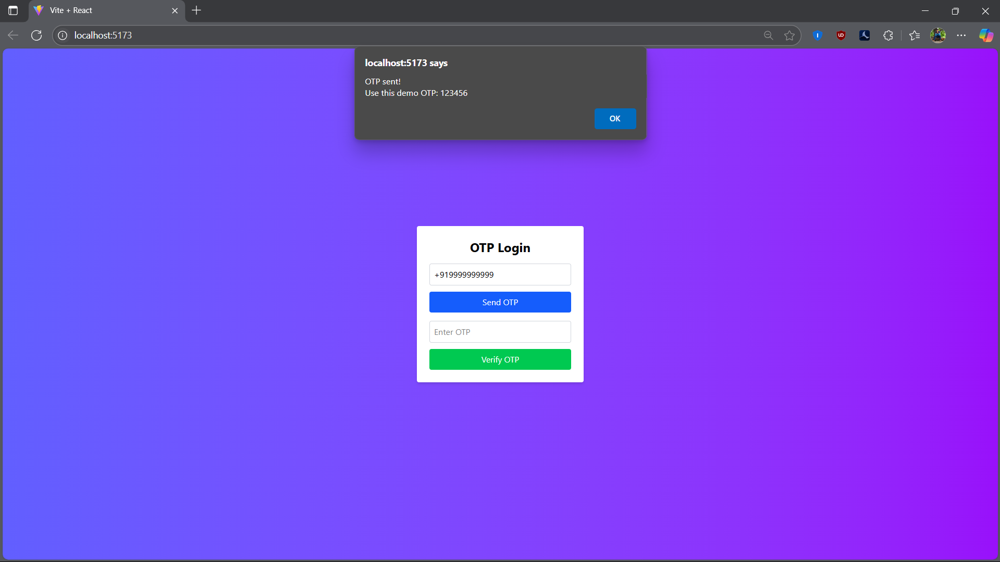
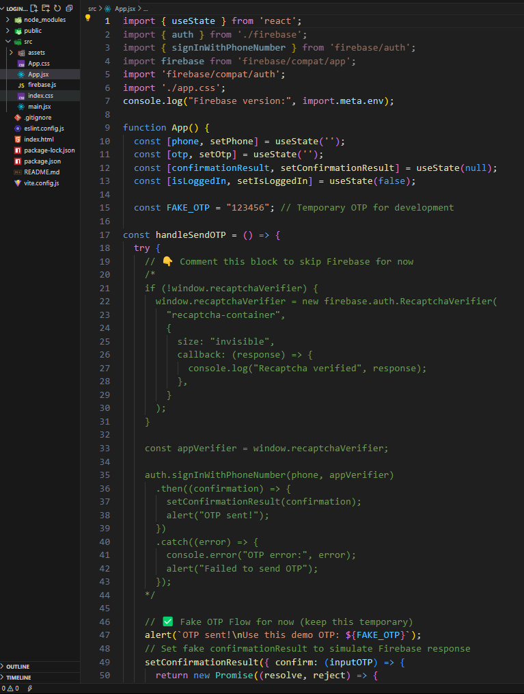

# 📱 Firebase OTP Login (Test Mode)

This is a React-based OTP login system using Firebase Phone Authentication — built for learning purposes.

⚠️ **Important Note**  
This OTP Login system uses Firebase Phone Authentication in test mode.(the firebase logic is commented and firebase apiKey is hashed for security purpose)
It only works with pre-configured test numbers (like `+919999999999`) for development purposes.  
**Billing was not enabled** to avoid any risk of real-world charges.  
This project was created for **learning and practice only**.

---

## 🔧 Features

- Phone number login using Firebase Auth
- OTP input and verification
- Test mode setup using fake OTP (`123456`)
- Responsive UI with TailwindCSS
- Fully working fake login flow for demo/testing
---

## 📸 screenshots




---

## 🚀 How to Run

1. Clone the repo:
   ```bash
   git clone https://github.com/your-username/otp-login
   cd otp-login
   npm install
   npm run dev


Phone: +919999999999
OTP:   123456

## 📚 Learning Purpose Only
This project was made during practice sessions to understand how Firebase OTP login works.
Firebase billing is not enabled — the app uses a simulated OTP system (123456) to avoid any charges.

---

## 💡 Future Scope
Enable real OTP login by switching to live Firebase mode

Secure backend validation

Token storage with sessions

# Made with ❤️ by Himanshu Jagtap
